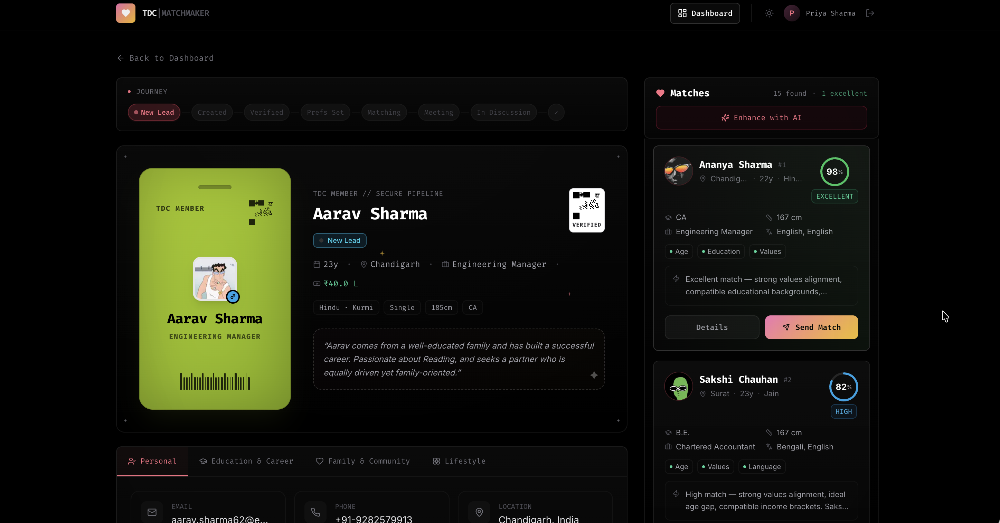
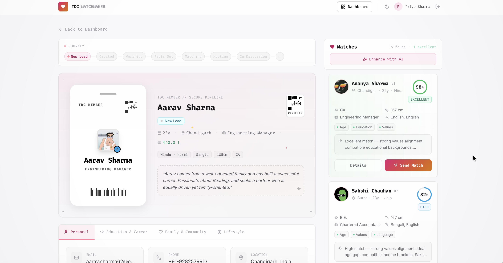

# TDC Matchmaker Assignment Submission

## Write-Up: Project Architecture & Decisions

**Tech Choices**

I built this on Next.js 14 with the App Router and TypeScript because honestly nothing beats the DX right now. Tailwind handled all the styling with a full design system under the hood, CSS variables driving both dark and light modes, glassmorphic panels, the whole vibe. Framer Motion makes everything feel alive without being obnoxious, just smooth page transitions and animated score bars that actually make data feel exciting. All 135 profiles come from a seeded deterministic generator so the data is consistent every time but still feels real and diverse. Auth is just localStorage, no database, no backend boilerplate. For an MVP that needs to ship fast and show the idea, it's the right call.

**Matching Logic**

The engine scores every opposite gender profile on 10 weighted dimensions. Values Alignment (18%) is the biggest deal because shared life goals actually matter. Lifestyle (14%), Education (12%), Age (12%), Income (10%), Religion and Caste (10%), Height (6%), Language (6%), Location (6%), and Family (6%) fill out the rest. The scoring is genuinely gender specific. For male clients it prioritizes younger age, lower income, and shorter height with kids alignment. For female clients it shifts towards profession compatibility, shared values, and relocation flexibility. Every match gets a clean 0 to 100 score with a human readable explanation so matchmakers can actually understand the why behind the number.

**AI Integration**

Groq runs the show here, llama 3.3 70B responding in like half a second with clean JSON. OpenRouter's free tier sits as a backup if Groq ever goes down, and both call direct from the browser so there's no serverless timeout nonsense. When you click "Enhance with AI" it ships the top 5 matches to the LLM with a tight prompt, gets back a JSON array of explanations, and maps them right onto the match cards. If the model decides to ramble instead of returning JSON, a sentence extraction fallback scans the raw text for each profile name and salvages whatever context it can find. If absolutely everything fails the original deterministic explanations stay untouched so the user never sees a blank slate.

**Assumptions Made**

Static JSON was enough for 135 profiles and an MVP build. No point spinning up a database when the focus should be on the algorithm and the experience. Auth is mocked because the assignment called for a login screen and a gated dashboard, not a production identity system. The dashboard leans read heavy because matchmakers are scanning and matching, not editing profiles. Dark and light themes both got the full treatment because forcing dark mode on everyone is a choice and not a good one.

## How It Looks

  
  

## Submission Links

| Item | Link |
|------|------|
| **Live Site** | https://tdc-matchmaker-silk.vercel.app |
| **GitHub Repo** | https://github.com/srivtx/tdc-matchmaker |
| **Demo Login** | `priya.sharma` / `tdc2024` |
